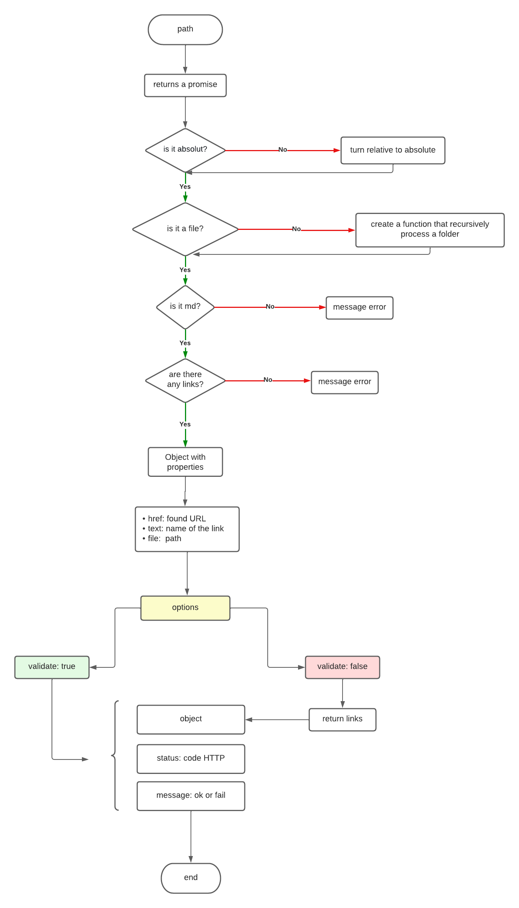

# Markdown Links


<table align="right">
 <tr><td> <a href="README.md"> English</a></td></tr>
 <tr><td><a href="README_es.md"> Español</a></td></tr>
</td></tr>
</table>


## Content

* [1. Summary](#1-summary)
* [2. General aspects](#2-general-aspects)
* [3. Install](#3-install)
* [4. Usage](#4-usage)
* [5. Flowchart](#5-flowchart)

***


## 1. Summary

Tool created with [Node.js](https://nodejs.org/), hat reads and analyzes files in `Markdown`, format to verify the contained links and report
some statistics.

## 2. General aspects

* The estimated time range to complete the project was 4 Sprints.

* The **library** y el **executable script** (command-line tool -
  CLI) are implemented in JavaScript and executed with Node.js.
  
 * [Chalk](https://www.npmjs.com/package/chalk) was used to customize
 the style of your application in the terminal.

* ES Modules `(import/export)`,  were used for this project, instead of CommonJS `(require/module.exports)`.

## 3. Install 

``` set up
npm install markdown-links-analyzer
```

## 4. Usage 
### JavaScript API

#### `mdLinks(path, options)`

##### Argumentos

* `path`: **absolute** o **relative** path to the **file** or **folder**.
If the provided path is relative, it should be resolved relative to the directory
from which Node is invoked - _current working directory_.
* `options`: An object with **only** the following property:
  - `validate`: A boolean that determines whether to validate the
    found links.

### CLI (Command Line Interface)

The executable of our application should be able to be executed through the
**terminal** in the following way:

`md-links <path-to-file> [options]`

For example:

```sh
$ md-links ./some/example.md
./some/example.md http://algo.com/2/3/ Link a algo
./some/example.md https://otra-cosa.net/algun-doc.html algún doc
./some/example.md http://google.com/ Google
```

The default behavior should not validate if the URLs respond ok or not,
It should only identify the Markdown file (based on the provided
path), analyze the Markdown file, and print the encountered links
along with the file path where they appear and the text inside the link (truncated to 50 characters).

#### Options

##### `--help`

If we pass the `--help` option, the output will show a help message that explains the usage and available options of the tool. It would provide instructions on how to run the tool. 

For example:

```sh
$ md-links ./some/example.md --help
Usage: mdLinks [path] [options]
--validate   Validate the status of each link.
--stats      Display statistics about the links.
--help       Display help information.
```

##### `--validate`

If the `--validate`, option is passed, the module makes an HTTP request to
check if the link works or not. If the link results in a redirection to a
URL that responds ok, then we consider the link as ok.

For example:

```sh
$ md-links ./some/example.md --validate
./some/example.md http://algo.com/2/3/ ok 200 Link a algo
./some/example.md https://otra-cosa.net/algun-doc.html fail 404 algún doc
./some/example.md http://google.com/ ok 301 Google
```

We can see that the output in this case includes the word `ok` or `fail` after the
URL, as well as the status of the HTTP response to that
URL.

##### `--stats`

If we pass the `--stats` option, the output will be a text with basic statistics
about the links.

```sh
$ md-links ./some/example.md --stats
Total: 3
Unique: 3
```

We can also combine `--stats` and `--validate` to obtain statistics that require the validation results.

```sh
$ md-links ./some/example.md --stats --validate
Total: 3
Unique: 3
Broken: 1
```

## 5. Flowchart


